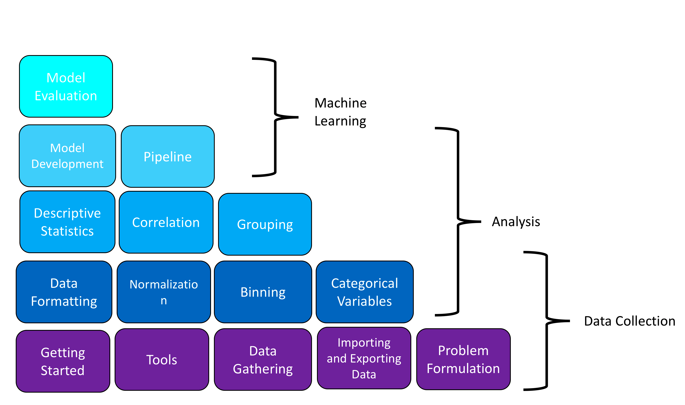
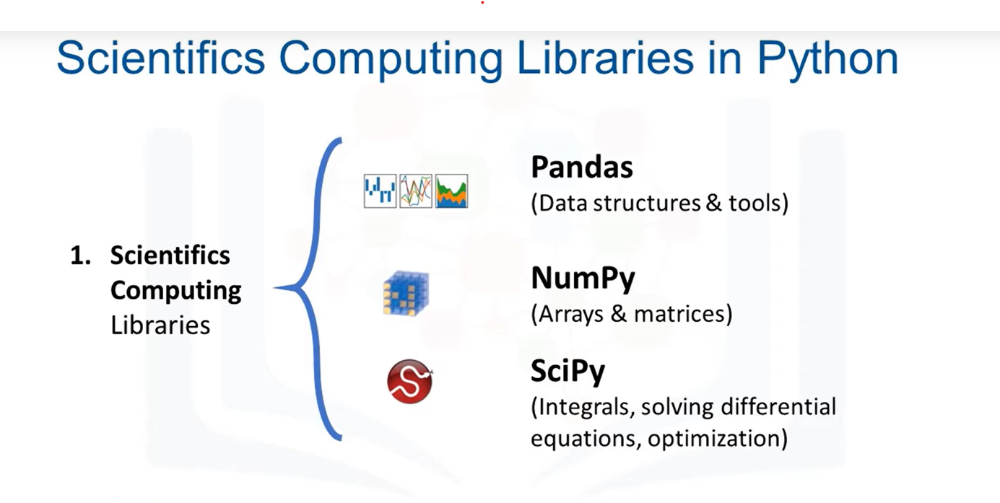
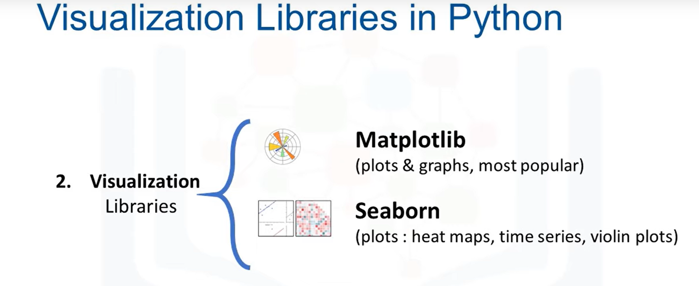

# Data Analysis with Python

Welcome to Data Science with Python. In this course, you will go over everything from how to load data to building basic machine learning models. Each level in the pyramid summarises concepts you will learn in each module. The outer labels give a general summary. As you can see, this course will start you off with the basics, the libraries you need and how to work with data. You will learn how to analyze data using summary statistics; this section is useful if you would like to make an argument with data. Finally, you will learn how to build Machine Learning Models and see how these models work in the real world.

## Learning Objectives
In this course you will learn about:

* Data Acquisition
* How to Obtain Basic Insight From a Dataset
* Data Wrangling
* Exploratory Data Analysis
* Model Development
* Model Evaluation

## SYLLABUS
### Module 1 - Introduction

* Introduction to Data Analysis with Python
* The Problem
* Understanding the Data
* Python Packages for Data Science
* Importing and Exporting Data in Python
* Getting Started Analyzing Data in Python

### Module 2 - Data Wrangling

* Pre-processing Data in Python
* Dealing with Missing Values in Python
* Data Formatting in Python
* Data Normalization in Python
* Binning in Python
* Turning Categorical Variables Into Quantitative Variables in Python

### Module 3 -  Exploratory Data Analysis

* Exploratory Data Analysis
* Descriptive Statistics
* GroupBy in Python
* Analysis of Variance ANOVA
* Correlation
* Correlation - Statistics

### Module 4 - Model Development

* Model Development
* Linear Regression and Multiple Linear Regression
* Model Evaluation Using Visualization
* Polynomial Regression and Pipelines
* Measures for In-Sample Evaluation
* Prediction and Decision Making

### Module 5 - Working with Data in Python

* Model Evaluation and Refinement
* Overfitting, Underfitting and Model Selection
* Ridge Regression
* Grid Search
* 
## Scientifics Computing Libraries in Python

## Visualization Libraries in Python

